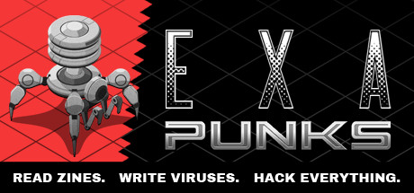

> The year is 1997. You used to be a hacker, but now you have the phage. You made a deal: one hack, one dose. There’s nothing left to lose… except your life.

# EXAPUNKS

My solutions to the game [EXAPUNKS](https://store.steampowered.com/app/716490/EXAPUNKS/) by [Zachtronics](https://www.zachtronics.com/) in which you need to solve puzzles by writing tiny programs in an [assembly-like language](https://steamcommunity.com/sharedfiles/filedetails/?id=1480557969).

## Solutions

<!-- EXA_START -->
| Level                                                                                                                       | Cycles | Size | Activity |
|-----------------------------------------------------------------------------------------------------------------------------|--------|------|----------|
| [1: Trash World News (Tutorial 1)](solutions/01-trash-world-news-tutorial-1)                                                | 4      | 3    | 2        |
| [2: Trash World News (Tutorial 2)](solutions/02-trash-world-news-tutorial-2)                                                | 9      | 9    | 2        |
| [3: Trash World News (Tutorial 3)](solutions/03-trash-world-news-tutorial-3)                                                | 11     | 14   | 4        |
| [4: Trash World News (Tutorial 4)](solutions/04-trash-world-news-tutorial-4)                                                | 407    | 11   | 2        |
| [5: Euclid's Pizza (Order System)](solutions/05-euclids-pizza-order-system)                                                 | 13     | 16   | 1        |
| [6: Mitsuzen HDI-10 (Left Arm)](solutions/06-mitsuzen-hdi-10-left-arm)                                                      | 241    | 23   | 6        |
| [7: Last Stop Snaxnet (Factory 11)](solutions/07-last-stop-snaxnet-factory-11)                                              | 31     | 11   | 2        |
| [8: Zebros Copies (Point-Of-Sale System)](solutions/08-zebros-copies-point-of-sale-system)                                  | 110    | 29   | 3        |
| [9: SFCTA Highway Sign #4902 (Remote Access Interface)](solutions/09-sfcta-highway-sign-4902-remote-access-interface)       | 166    | 10   | 1        |
| [10: Unknown Network 1 (Unknown Context)](solutions/10-unknown-network-1-unknown-context)                                   | 30     | 21   | 27       |
| [11: UC Berkeley (EECS Department)](solutions/11-uc-berkeley-eecs-department)                                               | 428    | 33   | 7        |
| [12: Workhouse (Work Management System)](solutions/12-workhouse-work-management-system)                                     | 544    | 49   | 2        |
| [13: Equity First Bank (San Fancisco)](solutions/13-equity-first-bank-san-fancisco)                                         | 3027   | 14   | 10       |
| [14: Mitsuzen HDI-10 (Heart)](solutions/14-mitsuzen-hdi-10-heart)                                                           | 158    | 30   | 29       |

| Battle                                                                                                                     | Wins | Draws | Losses | Rating |
|----------------------------------------------------------------------------------------------------------------------------|------|-------|--------|--------|
<!-- EXA_END -->
